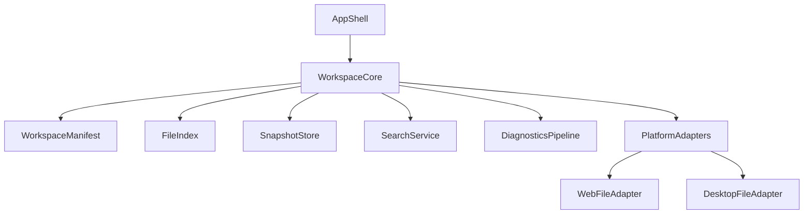

# Workspace Architecture

The shared workspace layer is the foundation for both the `Web/PWA` editor and the `Desktop` IDE.

## Goals

- one project model across browser and desktop
- local-first persistence
- repository-aware AI context
- recoverable history and snapshots
- deterministic permission boundaries

## Core Components

## Layers

### Workspace Manifest

- workspace id
- root metadata
- active files
- open tabs
- selected platform profile
- current policy preset

### File Index

- normalized paths
- lightweight content metadata
- optional symbol metadata
- classification flags such as `secret`, `generated`, `binary`

### Snapshot Store

- point-in-time workspace snapshots
- crash recovery checkpoints
- export/import bundles for offline portability

### Search Service

- plain text search in all supported environments
- semantic or symbol index when platform resources allow it

### Diagnostics Pipeline

- parser or linter diagnostics
- git diff awareness
- AI hints and code action candidates

## Persistence Strategy

- `Web/PWA`: IndexedDB for workspace state and snapshots
- `Desktop`: SQLite or local files for metadata, plus real disk-backed projects
- shared export format for moving workspaces between environments
